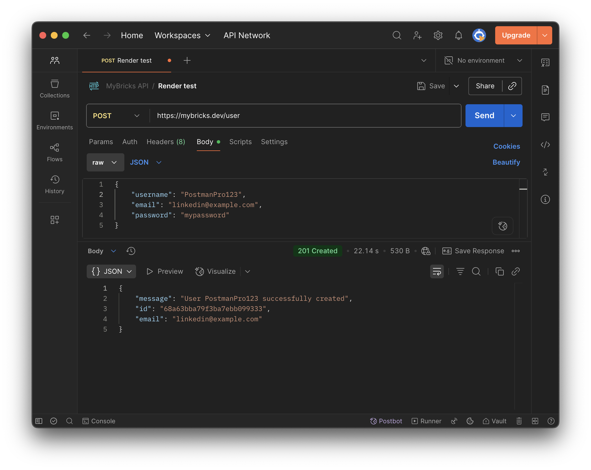
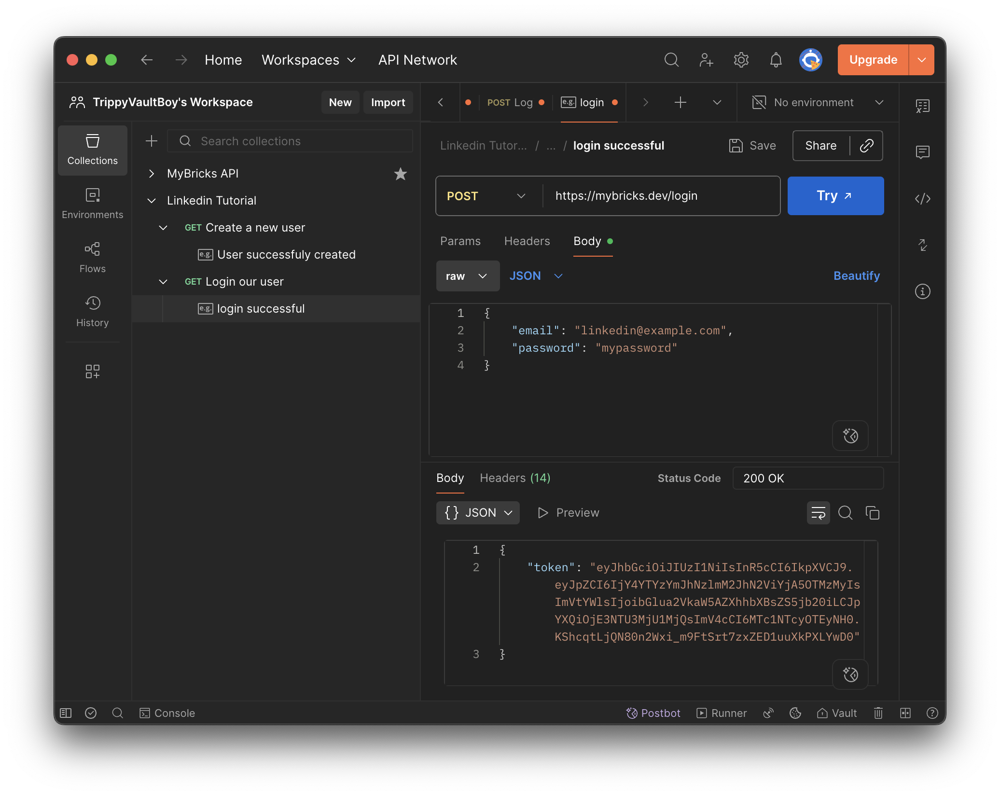
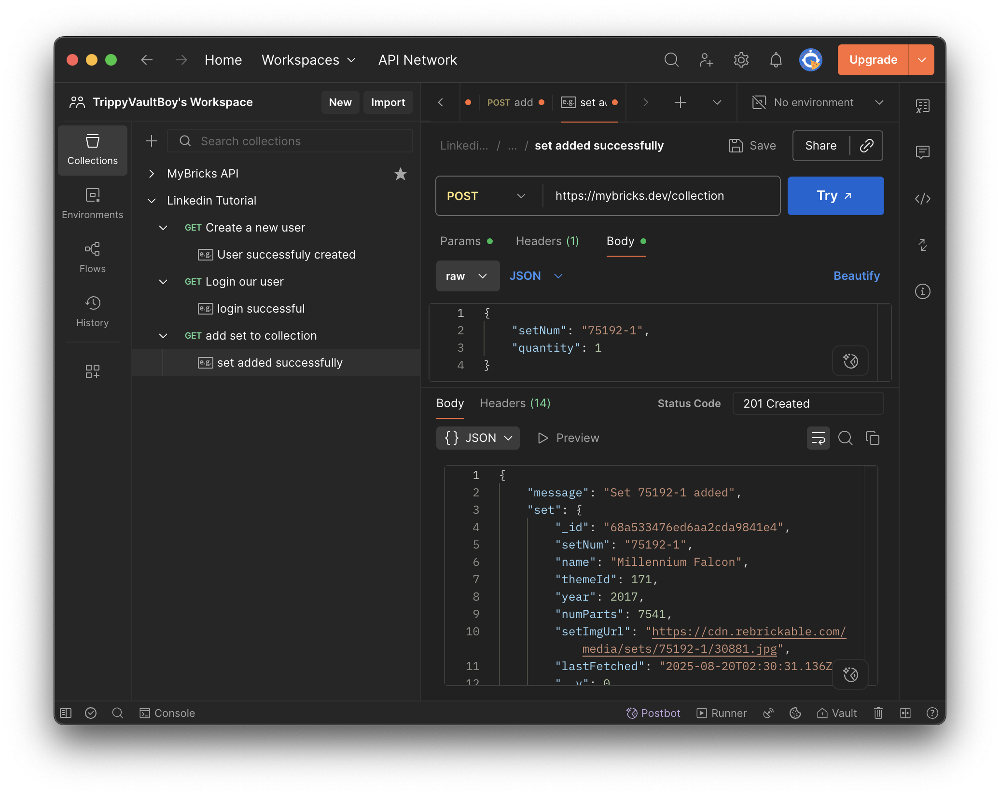

# myBricks API  

## About the Developer  

Hi, I’m **Tanner Saint**, a passionate full-stack web developer focused on building clean, efficient, and user-friendly applications.  

- [LinkedIn](https://www.linkedin.com/in/tannersaint/)  
- [Portfolio](https://www.tannersaint.dev/)  

## Project Description  

This project, **myBricks**, is an Express.js-based API designed to simplify LEGO collection management. myBricks API features secure user authentication with JWT, a MongoDB-powered collection database, and caching to reduce external API calls. Building this project strengthened my skills in backend development, authentication, and database management, while giving me experience creating a production-ready API from scratch.

## Tech Stack

- **Backend:** [Node.js, Express.js, MongoDB Atlas, JSON Web Token]
- **Tools Used** [Swagger, Postman]

## The Story of Development  

This project started with a rough outline of requirements for our T4 final project.  
During development, I:  
- Designed the general idea of what I wanted myBricks to do: User creation and authentication with JWT, add and remove sets to a users collection as well a cache sets to prevent repetative calls to the rebrickable api.
- Implemented the minimum viable product as well as a few strech goals: API documentation with swagger, a logger for requests and errors, and live hosting through render.  

## Features Implemented  

- Account creation with Username, email and password
- Login with credentials given and are provided with a JWT token for authenticaion
- Standard CRUD operations for managing LEGO sets in a users collection
- Caching of calls to the rebrickable api
- API documentation with swagger
- Live hosting at mybricks.dev with render

## Features To Be Implemented  

- Basic Frontend for ease of use
- Collection filters and sorting

## Challenges Faced  

The hardest part of this project was:  
- Exporting the Postman collection JSON and conversion to swagger compatable YAML

## Screenshots  

  
*Example of user creation*

  
*Example user login*

  
*Example of adding a set to collection*

## Visit the live site
[Visit myBricks](https://mybricks.dev)